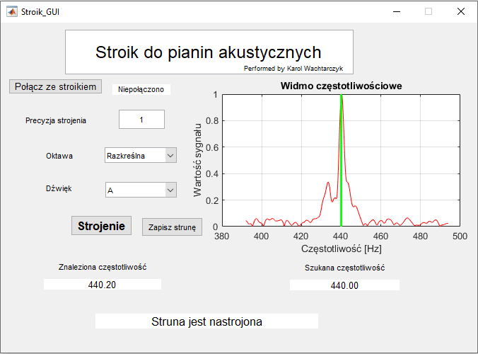

# StroikDoPianina

#### Disclaimer: Transcription to English in progress

StroikDoPianina jest programem opartym na MATLAB GUI, który pozwala na nastrojenie pianina akustycznego.

- program uwzględnia efekty wpływające na strój w rzeczywistym pianinie (nieliniowość częstotliwości drgań strun i ich efekt, czyli [rozciąganie oktaw](https://en.wikipedia.org/wiki/Piano_acoustics#The_Railsback_curve)), a nie tylko wyidealizowany model (strój równomiernie temperowany)

- Stroik został użyty z powodzeniem do nastrojenia domowego pianina akustycznego (Balthur (Legnica), prod. ~1990 r.)

- zapewnia wstępną integrację z robotem strojącym komunikującym się przez port szeregowy z Arduino

## Opis

Interfejs graficzny Stroika przedstawiono na poniższym rysunku:

Po włączeniu programu użytkownik może się połączyć ze stroikiem przy pomocy przycisku <b>Połącz ze stroikiem</b>. Jeżeli to zrobi, możliwe będzie dokonywanie korekcji częstotliwości przy użyciu sprzężenia mechanicznego. W przypadku braku połączenia – strojenie będzie polegać tylko na porównywaniu częstotliwości podstawowej sygnału z mikrofonu z częstotliwością drgań podstawowych wzorca (w tym programie: stroju równomiernie temperowanego).

W polu <b>Precyzja strojenia</b> użytkownik ustala maksymalną różnicę częstotliwości w [centach](<https://en.wikipedia.org/wiki/Cent_(music)>) pomiędzy częstotliwością wzorcową, a tą, którą oprogramowanie uzna za wystarczająco dokładną.

Pola wyboru <b>Oktawa i Dźwięk</b> służą do ustawienia, który dźwięk aktualnie będzie strojony.

Po naciśnięcie przycisku <b>Strojenie </b> program rozpocznie sekwencję strojenia. W kroku pierwszym, pobierze próbkę dźwięków tła i wyliczy częstotliwości potrzebne do rozpoczęcia procesu. Następnie wyświetli się komunikat: „Można rozpocząć nagrywanie”. Od tego momentu po wprawieniu struny w drgania program rozpocznie proces strojenia. Pojawi się wtedy komunikat: „Struna jest w trakcie strojenia” i rozpocznie się pętla, w której będą kolejno wykonywane:

1. nagranie próbki sygnału,
2. okienkowanie pobranego sygnału (oknem Hamminga),
3. wyliczenie widma częstotliwościowego przy pomocy transformacji świergotowej sygnału,
4. wyświetlenie widma w programie,
5. wyznaczenie różnicy częstotliwości pomiędzy zadaną, a oczekiwaną,
6. \*korekcja mechaniczna lub zakończenie pracy w przypadku osiągnięcia zadowalającego rezultatu.

\* Wykonanie korekcji (punkt 6.) jest uzależnione od tego, czy użytkownik połączył się z płytką Arduino.

Po uzyskaniu częstotliwości z oczekiwanego zakresu wyświetli się komunikat: <b>„Struna jest nastrojona”</b>.

Jeżeli struna na pewno została już nastrojona, poprzez naciśnięcie przycisku <b>Zapisz strunę</b> zapisuje się strunę w tablicy.
Po uzyskaniu takiego komunikatu można przejść do strojenia kolejnych strun.

#### Uwagi

Program został napisany podczas przygotowywania pracy inżynierskiej. Promotorem pracy był dr inż. Marcin Korzeniowski (Katedra Obróbki Plastycznej, Spawalnictwa i Metrologii na Wydziale Mechanicznym Politechniki Wrocławskiej )
